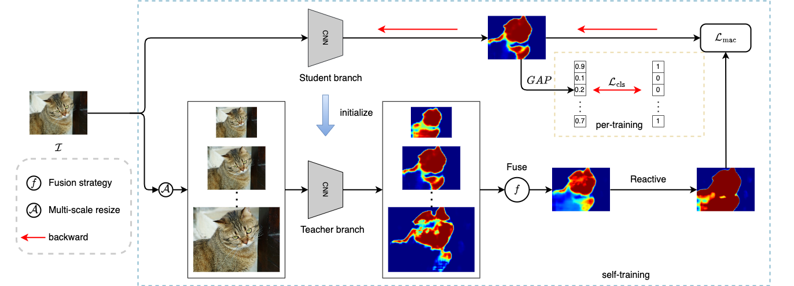
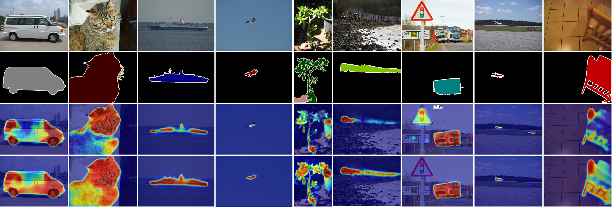

# SMAF
---
The Pytorch implementation of *A Self-Training Framework Based on Multi-Scale Attention Fusion for Weakly Supervised Semantic Segmentation*
[[project]](https://bupt-ai-cz.github.io/SMAF/) [[arXiv]](https://arxiv.org/abs/2305.05841) 

## News
---
- ⚡(2023-6-13): We have already released the code for SMAF, and the required dataset will be provided soon.

## Overview
---

Weakly supervised semantic segmentation (WSSS) based on image-level labels is challenging since it is hard to obtain complete semantic regions. To address this issue, we propose a self-training method that utilizes fused multi-scale class-aware attention maps. Our observation is that attention maps of different scales contain rich complementary information, especially for large and small objects. Therefore, we collect infor- mation from attention maps of different scales and obtain multi- scale attention maps. We then apply denoising and reactivation strategies to enhance the potential regions and reduce noisy areas. Finally, we use the refined attention maps to retrain the network. Experiments showthat our method enables the model to extract rich semantic information from multi-scale images and achieves 72.4% mIou scores on both the PASCAL VOC 2012 validation and test sets.





## Environment
- Python 3.8
- Pytorch>=1.6.0
- Torchvision
- CUDA>=9.0
- Others
```
pip install -r requirements.txt
```

## Usage
---

### Dataset & Pretrained model
Download dataset [PASCAL VOC 2012]() and ensure that the folder structure should be as follows:
- File structure
  ```
  SMAF
    ├──dataset
    |    ├── VOC2012
    |          ├──ImageSets
    |          ├──JPEGImages
    |          ├──metadata
    |          ├──pseudo_mask
    |          |    └──fused
    |          |        ├── 2007_000032.png
    |          |        ├── 2007_000039.png
    |          |        └── ...
    |          ├──SALImages
    |          ├──SegmentationClass
    |          └──SegmentationClassAug
    |               
    ├──smaf
    |   ├──logdir
    |   |   ├──cam_o_vec
    |   |   ├──eps_cls_mode
    |   |   └──proda_model      
    |   └── ...
  ```
- The folder `fused` contains the pseudo masks provided by us [[baidu]](). You can generate it by yourself.
- The `smaf/logdir/eps_cls_mode` contains the pre-trained model, and we use [EPS](https://github.com/halbielee/EPS) as the initial model. We can obtain it from the official website or train it ourselves. Here,we provide the [initial model]() that we trained.
- The `smaf/logdir/cam_o_vec` is used to store attention maps after multi-scale fusion. You can download this folder from [baidu](), or generate it yourself.
- The `smaf/logdir/proda_model` is the output folder. You can download our result from [[baidu]]() 

### Multi-scale Fusion
Before training our model, you need to following command to generate the fused Multi-scale attention maps:
```
bash script/gen_fusion.sh
```
The result will be saved in `smaf/logdir/cam_o_vec`.

### Train
Please run the following command to train our core model:
```
bash script/train_fusion.sh
```

### generate pseudo-mask and evalue
After the training process, you can generate pseudo masks and validate their quality using the following command:
```
bash script/gen_pm.sh
```

### segmentation
We use the segmentation repo from [DeepLab-V2](https://github.com/kazuto1011/deeplab-pytorch)

## result
---


## Acknowledgement
---

Some parts of this code are borrowed from [EPS](https://github.com/PengtaoJiang/EPS) and [Proda]()

## Citation
```
@article{yang2023self,
  title={A Self-Training Framework Based on Multi-Scale Attention Fusion for Weakly Supervised Semantic Segmentation},
  author={Yang, Guoqing and Zhu, Chuang and Zhang, Yu},
  journal={arXiv preprint arXiv:2305.05841},
  year={2023}
}
```
## Contact
Guoqing Yang (yangguoqing@bupt.edu.cn)

Chuang Zhu (czhu@bupt.edu.cn)

If you have any questions, you can contact us directly.

